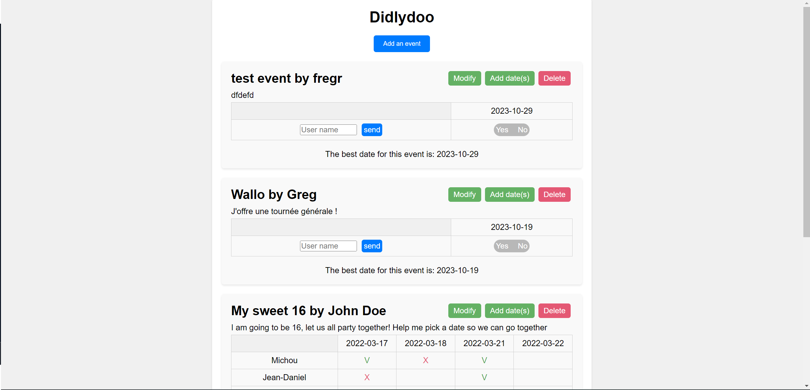

# didlydoo-app

You have been hired by a "truly disruptive" startup, to create a revolutionnary tool to plan events with friends and relatives. Introducing Didlydoo, the event planner!

A backend developer has already created an API for the tool, so you can focus on the frontend.

Your tasks is to :

-   🌱 Display all the events, including everyone's availability
-   🌱 Allow users to create events
-   🌱 Allow users to add their availability to an existing event
-   🌱 Edit an event name/description/author
-   🌱 Delete an event
-   🌱 You must validate your inputs before sending the data to your backend, inputs required must be filed and shorter than 256 characters. If it's not the case you don't send the request and display the appropriate error **below** the input.

Bonus :

-   🌼 Display the best possible date for the event according to everyone availabilities

## Screenshots




## Badges

[](https://choosealicense.com/licenses/mit/)
[](https://choosealicense.com/licenses/mit/)
[](https://choosealicense.com/licenses/mit/)
[](https://choosealicense.com/licenses/mit/)


## Run Locally

Clone the project

Go to the project directory

```bash
  cd backend
```

Start the server

```bash
  node server/index.mjs
```


## work progress

This project was made in October 2023 during a formation at BeCode. 

## Authors

- [@Carole](https://github.com/Carole-GRD)
- [@Lucas](https://github.com/lbeauloi)
- And me

